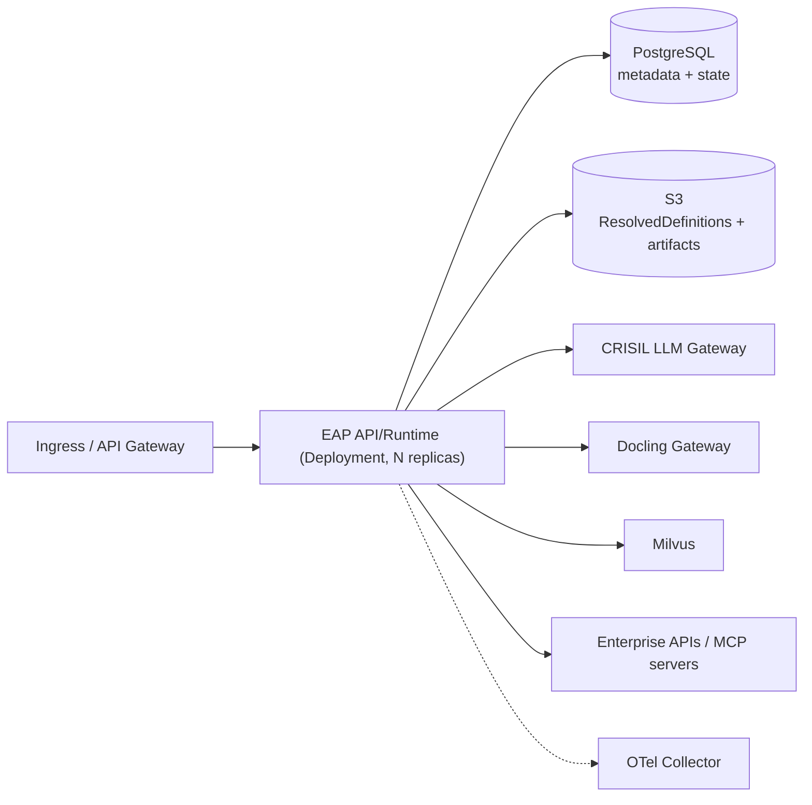

# Core EAP v1.0 — Deployment (Phase 5)

Deployment mechanics are intentionally kept separate from the logical module
boundaries. The logical decomposition does **not** imply one service per module:
MVP1 ships a single deployable.

## Topology (MVP1)

- **One deployable**: `EAP API/Runtime` (API Gateway + Control Plane + Runtime +
  Providers + Capabilities + Knowledge + Adapters in one process).
- **Optional second unit**: a `Worker` — only if async/long-running execution is
  required. Not assumed for MVP1 (the code supports it: the coordinator and
  strategies are transport-agnostic).
- **Backing services are existing/reused**: PostgreSQL, S3, CRISIL LLM Gateway,
  Docling Gateway, Milvus, enterprise DBs/APIs/MCP servers, enterprise IAM/SSO,
  enterprise secrets. EAP does not rebuild them.

## Configuration & secrets

- Non-secret config via `ConfigMap` -> environment variables (`Settings`).
- Secrets via a Kubernetes `Secret` (populated by the enterprise secrets manager /
  External Secrets Operator), exposed as `EAP_SECRET_<NAME>` env vars and resolved
  at runtime by `EnvSecretsProvider`. Specs and bindings only ever contain logical
  `secret_ref` names — never secret values.
- The same image runs in every environment; only configuration changes
  (`overlays/dev` uses in-process fakes; `overlays/prod` targets real backends).

## Kubernetes resources (`deploy/kubernetes`)

`base/` (kustomize): `Deployment`, `Service`, `ServiceAccount`, `ConfigMap`,
`HorizontalPodAutoscaler`, `NetworkPolicy`. Overlays `dev` and `prod` patch
replicas, resources, image tag and config. Security posture: non-root,
read-only root filesystem, dropped capabilities, no privilege escalation,
readiness/liveness on `/health`.

On EKS, grant AWS access (S3) via IRSA by annotating the `ServiceAccount` with the
IAM role ARN (see `serviceaccount.yaml`).

## GitOps (`deploy/argocd`)

Argo CD `AppProject` + `Application` per environment. Dev auto-syncs; prod is
gated (no automatic prune) for controlled promotion. The release pipeline pushes
the image and bumps the overlay image tag; Argo CD reconciles the change.

## CI/CD (`.github/workflows/ci.yaml`)

On every PR/commit: `ruff` (lint), `mypy` (types), `lint-imports` (architecture
boundaries), JSON-schema drift check, and `pytest`. On `main`, the container image
is built; publishing + GitOps tag bump are handled by the release pipeline.

## Scaling & reliability

- Horizontal scaling via HPA on CPU/memory (extendable to custom/RPS metrics).
- Reliability primitives (retry/backoff, circuit breaker) are applied at the
  Model Provider and Capability layers.
- State/checkpoints persist to PostgreSQL so long-running/HITL runs can resume.
