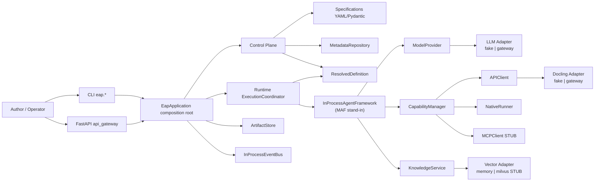
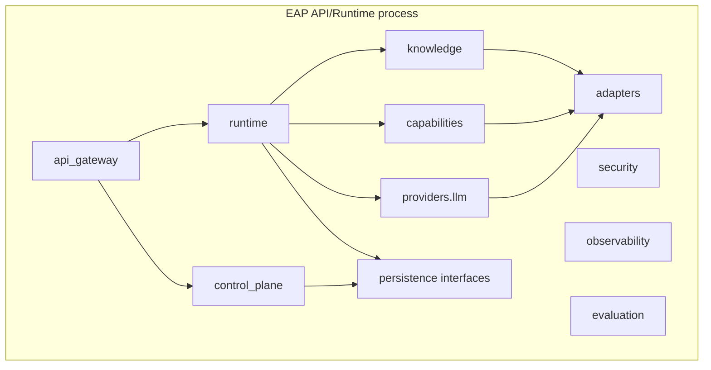

# §2 — System Architecture

Status labels describe **CURRENT IMPLEMENTATION** unless noted.

## 2.1 System context

## 2.2 Container / component view (single deployable)

**DESIGNED:** Optional Worker for long-running jobs.  
**CURRENT:** One deployable only — API + Control Plane + Runtime in-process.

## 2.3 Layer responsibilities (as implemented)

| Layer | Package | Status | Key types |
| --- | --- | --- | --- |
| 0 Domain | `eap.specifications`, `eap.common` | IMPLEMENTED | `EapResource`, `ResolvedDefinition`, `Settings`, events, errors |
| 1 Cross-cutting | `security`, `observability`, `evaluation`, `persistence` | PARTIAL | Interfaces + memory defaults; stubs for Postgres/S3 |
| 2 Control Plane | `eap.control_plane` | IMPLEMENTED | `ControlPlane`, `Resolver`, `Registry`, … |
| 3 Adapters | `eap.adapters` | PARTIAL | Fake + HTTP stubs; Milvus/DB/S3 real paths stubbed |
| 4 Services | `providers`, `capabilities`, `knowledge` | PARTIAL | ModelProvider IMPLEMENTED; MCP STUBBED |
| 5 Runtime | `eap.runtime` | PARTIAL | Coordinator + SingleAgent + Workflow; MAF missing |
| 6 Composition | `eap.api_gateway` | IMPLEMENTED | `EapApplication`, FastAPI, CLI |

## 2.4 Component notes

### Specification Layer — IMPLEMENTED

Pydantic models + loader + SemVer + references. Location: `src/eap/specifications/`.

### Control Plane — IMPLEMENTED

Facade `ControlPlane` wires `SpecificationService`, `Registry`, `Catalog`, `Resolver`, `LifecycleService`, `GovernanceService`.

### ResolvedDefinition boundary — PARTIALLY IMPLEMENTED

Produced only by `Resolver.resolve` → `finalize()`. Consumed by `ExecutionCoordinator.run` after `verify_integrity()`. Nested `ResolvedBundle` is not deep-frozen.

### Runtime — PARTIALLY IMPLEMENTED

`ExecutionCoordinator` selects `SingleAgentStrategy` or `WorkflowStrategy`. Multi/Iterative stubbed.

### Microsoft Agent Framework — PLANNED / NOT IMPLEMENTED

Isolation seam: `AgentFrameworkAdapter`. Only implementation: `InProcessAgentFramework`.

### Model Provider — IMPLEMENTED (fake default)

`ModelProvider.invoke` / `stream` → `build_llm_adapter` → Fake or Gateway.

### Capability Manager — PARTIALLY IMPLEMENTED

Routes by `Capability.spec.protocol` to API / Native / MCP. Guardrail field unused at invoke.

### Knowledge Service — PARTIALLY IMPLEMENTED

Owns rerank (score), permission filter, citations. Backends via vector adapter.

### Adapters / Persistence / Security / Observability / Evaluation

See dedicated docs. Defaults favor in-memory/fake for local walking skeleton.

## 2.5 Related docs

- [designed-vs-implemented.md](designed-vs-implemented.md)
- [repository.md](repository.md)
- Legacy LLD notes (may mix design intent): `component-lld.md`, `sequence-diagrams.md`, `deployment.md`
