# Core EAP v1.0 — Sequence Diagrams (Phase 4)

> **Note:** Prefer diagrams in the v1.0 doc set ([`../README.md`](../README.md))
> when distinguishing MAF (designed) vs `InProcessAgentFramework` (current).

Runtime interactions for the primary flows. Participants map to components under
`src/eap/` — verify stand-ins/stubs before operational use.

## 1. Register a specification

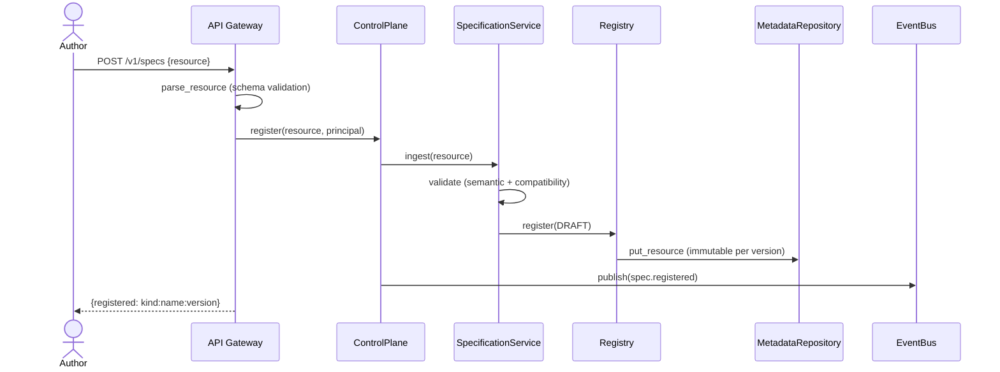

## 2. Resolve an agent (produce ResolvedDefinition)

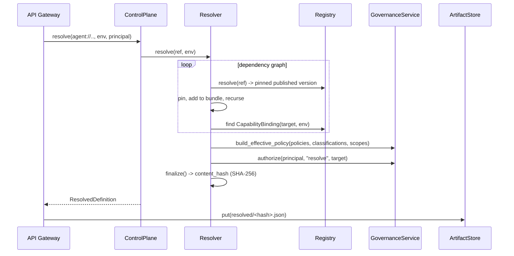

## 3. Run an agent

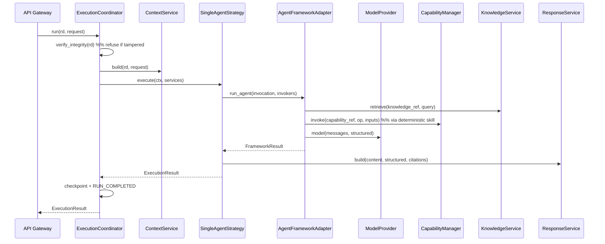

## 4. Run a workflow

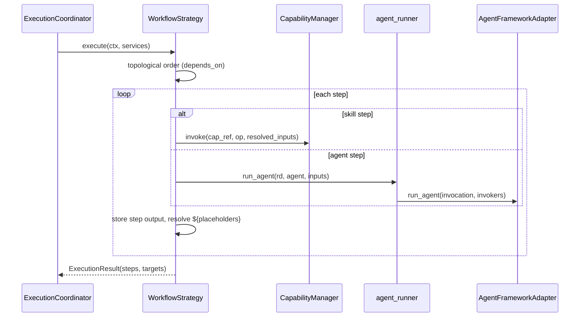

## 5. LLM invocation (with fallback)

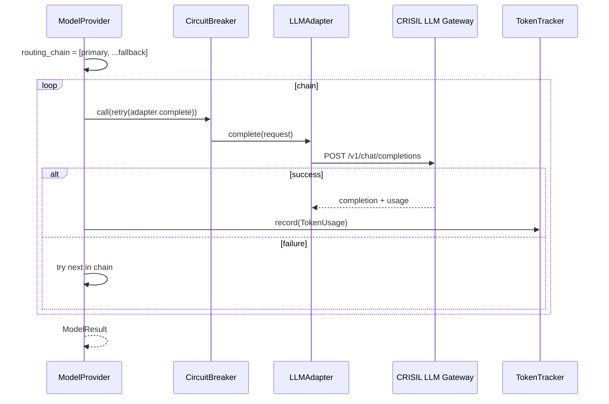

## 6. Capability via Docling (API protocol)

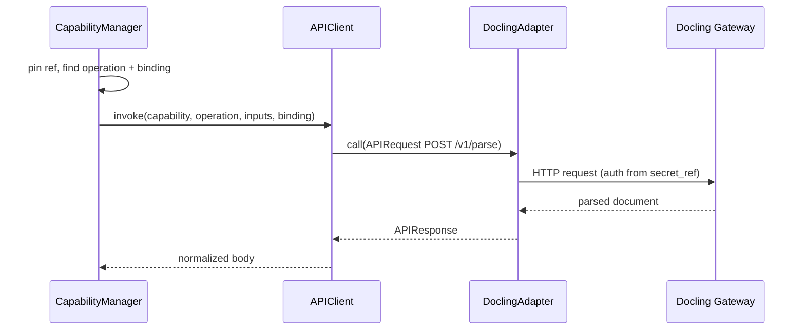

## 7. Capability via MCP

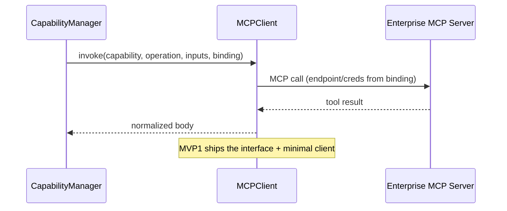

## 8. Knowledge retrieval

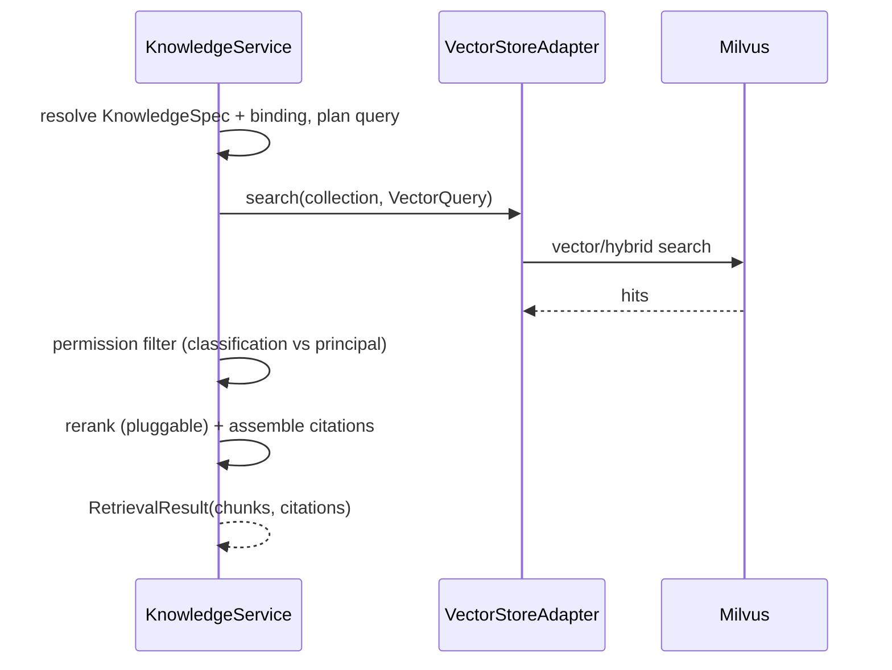

## 9. Human-in-the-loop (approval + resume)

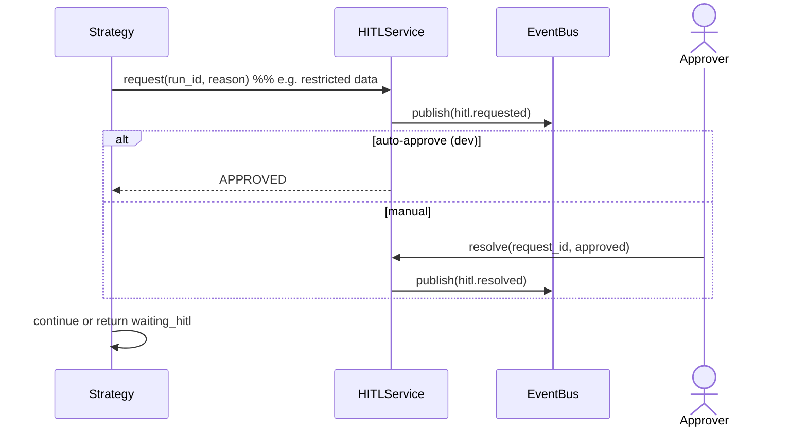

## 10. Failure, retry & resume

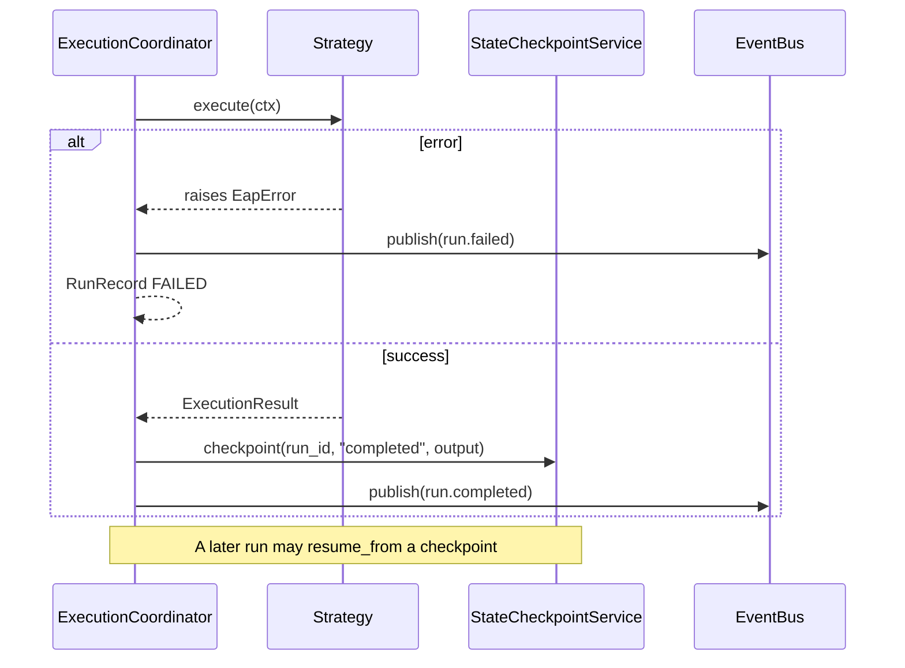

## 11. Evaluation & feedback

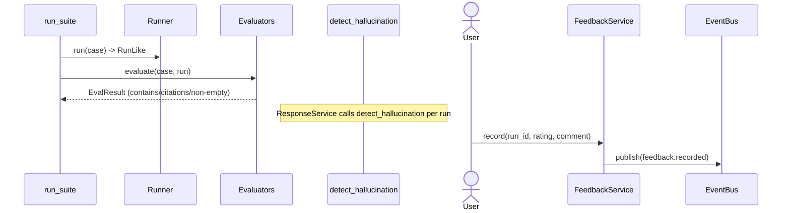
