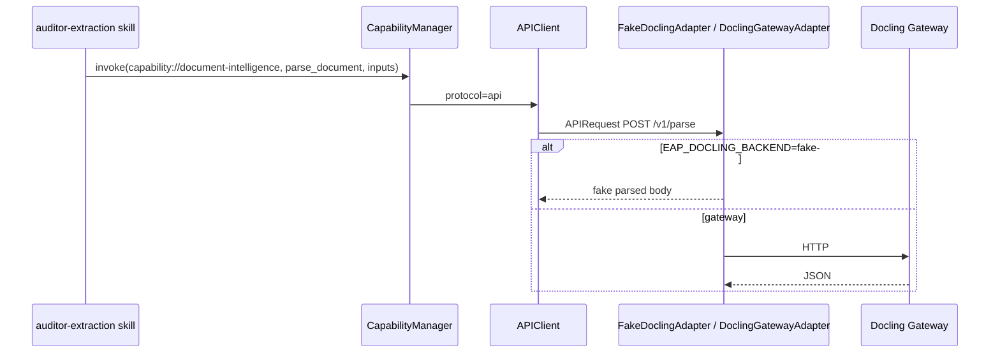

# §12 — Capability Architecture

## Components

| Piece | Location | Status |
| --- | --- | --- |
| CapabilitySpec | `specifications/capability.py` | IMPLEMENTED |
| CapabilityManager | `capabilities/manager/__init__.py` | PARTIAL (routing works; guardrail unused) |
| APIClient | `capabilities/api/` | IMPLEMENTED |
| NativeRunner | `capabilities/native/` | IMPLEMENTED |
| MCPClient | `capabilities/mcp/` | STUBBED |

## Routing

```text
CapabilityManager.invoke(rd, capability_ref, operation, inputs)
  → pin ref, load Capability from RD
  → select client by capability.spec.protocol
  → client.invoke(capability, operation, inputs, binding)
```

Clients map:

| Protocol | Client |
| --- | --- |
| `api` | `APIClient` → `build_api_adapter` (docling / enterprise) |
| `native` | `NativeRunner` + `NativeToolRegistry` |
| `mcp` | `MCPClient` → raises `NotImplementedError` |

## End-to-end: document-intelligence (IMPLEMENTED with fake default)



Evidence: `tests/test_runtime.py` asserts tool call `(capability://document-intelligence/1.0.0, parse_document)`.

## Gaps

- Per-invocation guardrails documented in module docstring but `_guardrail` never called in `invoke`.  
- No duplicated MCP→Adapter→MCP layer (good) — MCP simply unimplemented.
