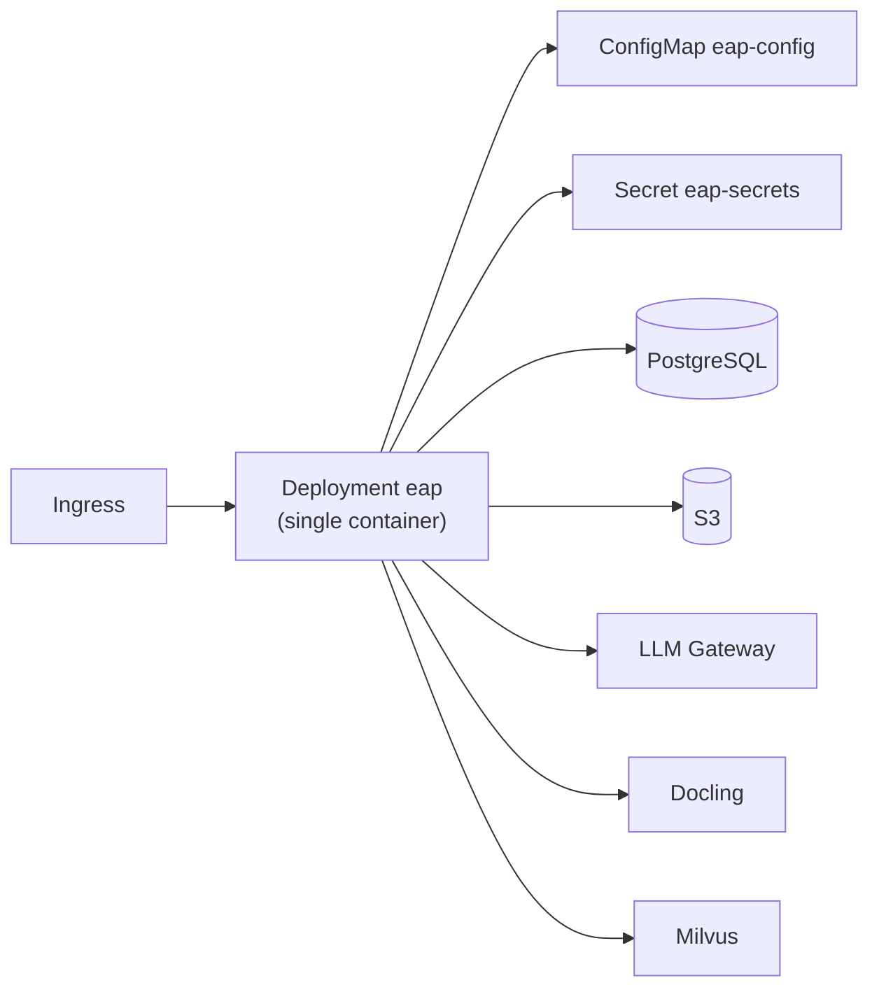

# §28 — Deployment Architecture

**Status:** Manifests IMPLEMENTED in-repo; live cluster apply not validated by this documentation pass.

## Topology

Single deployable matches MVP1. No worker Deployment in manifests.

## Artifacts present

| Path | Purpose |
| --- | --- |
| `Dockerfile` | Non-root image; runs API |
| `.dockerignore` | Build context hygiene |
| `deploy/kubernetes/base/` | Deployment, Service, SA, ConfigMap, HPA, NetworkPolicy, secret.example |
| `overlays/dev` | Namespace, replicas, fake backends config patch |
| `overlays/prod` | Higher replicas, resources-patch |
| `deploy/argocd/` | AppProject + eap-dev/eap-prod Applications |
| `.github/workflows/ci.yaml` | Quality gates + image build on main |
| `docs/architecture/deployment.md` | Narrative |

## Health / scaling / security (as declared)

- Probes: HTTP `/health` on port 8080  
- HPA: CPU/memory  
- Pod: non-root, read-only rootfs, drop caps  
- Secrets: example only — real secret material via enterprise process  

## What is not claimed

- No Terraform/CloudFormation in-repo  
- No verified EKS cluster state  
- Redis/Kafka operators not deployed by these manifests  
- Image registry name placeholder `REGISTRY/eap`
