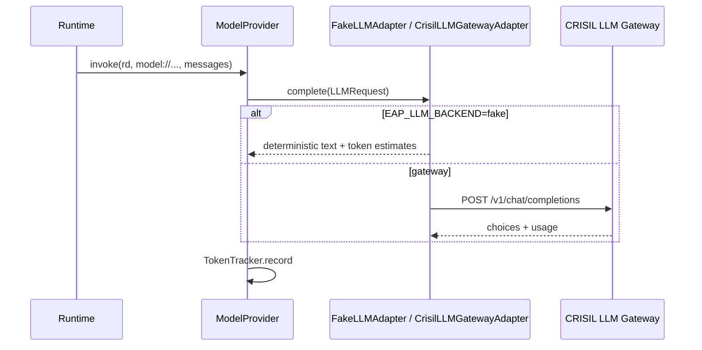

# §13 — Model Provider Architecture

**Package:** `src/eap/providers/llm/__init__.py`  
**Status:** IMPLEMENTED path with fake default; gateway HTTP PARTIAL; SSE STUBBED

## Path

```text
Runtime invoker
  → ModelProvider.invoke(rd, model_ref, messages, structured=…)
  → _routing_chain (primary + ModelProfile.spec.fallback pins)
  → _prepare: ModelProfile + CapabilityBinding → build_llm_adapter
  → CircuitBreaker + retry_call → adapter.complete
  → TokenTracker.record
```



## Features actually implemented

| Feature | Status |
| --- | --- |
| ModelProfile resolution from RD | IMPLEMENTED |
| Binding-based adapter + deployment | IMPLEMENTED |
| Fallback chain | IMPLEMENTED (`_routing_chain`) |
| Retry + circuit breaker | IMPLEMENTED |
| Structured output flag + JSON parse heuristic | PARTIAL |
| Token / cost tracking | IMPLEMENTED (cost uses `cost_per_1k_tokens`, default 0) |
| `stream()` API | PARTIAL — fake streams tokens; gateway yields single `complete()` chunk |
| Auth | Via binding `secret_ref` → `SecretsProvider` into adapter headers |

## Not how LLMs work here

LLM is **not** modeled as a generic MCP/API “tool”. Separate from `CapabilityManager`.
