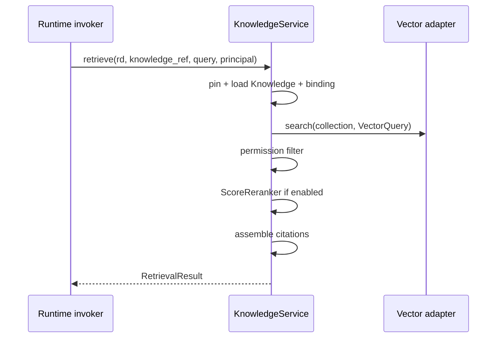

# §15 — Knowledge Architecture

**Package:** `src/eap/knowledge/__init__.py` — `KnowledgeService`

## Separation of concerns — IMPLEMENTED as designed

| Concern | Owner |
| --- | --- |
| KnowledgeSpec / logical `knowledge://` | specifications |
| Retrieval strategy selection, rerank, permissions, citations | **KnowledgeService** |
| Vector search transport | adapters (`InMemoryVectorAdapter` / `MilvusAdapter`) |

Agents never see Milvus hostnames — only bindings do.

## `retrieve` flow

## Feature status

| Feature | Status | Notes |
| --- | --- | --- |
| Vector retrieval | IMPLEMENTED | In-memory seeded corpus by default |
| Score rerank / top_n | IMPLEMENTED | `ScoreReranker` |
| Permission filtering | PARTIAL | Filters `restricted` unless principal has admin/steward roles |
| Citations | IMPLEMENTED | From chunk `metadata.source` when `spec.citations` |
| Hybrid retrieval | PARTIAL | Spec allows; backend still vector-only |
| Keyword strategy | PARTIAL | Logs fallback to vector |
| Milvus client | STUBBED | `MilvusAdapter.search` raises |
| S3 / DB as knowledge backends | PLANNED | Adapters exist for storage/DB but KnowledgeService only calls vector adapter |

## Spec example

`contracts/examples/ratings-knowledge.yaml` + binding in `bindings.dev.yaml` (`adapter: milvus`, `collection: ratings_knowledge_v2`).
