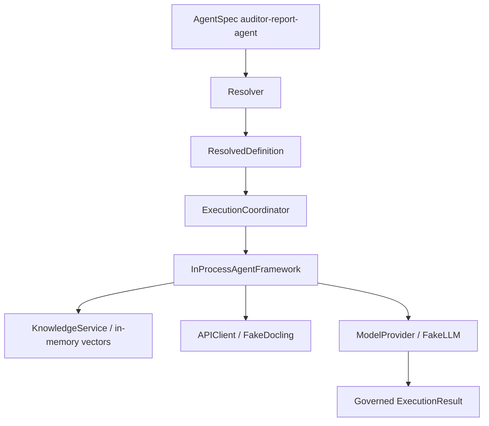

# §23 — End-to-End: Auditor Report Analysis

Reference example wired in `contracts/examples/` and exercised by CLI `eap demo` / tests.

## Intended business flow vs code

| Step | DESIGNED | CURRENT IMPLEMENTATION | Status |
| --- | --- | --- | --- |
| PDF document | Ingest via Docling | Client passes `document_id` string; fake adapter returns canned sections — **no PDF bytes uploaded in MVP path** | PARTIAL |
| Agent | auditor-report-agent | YAML + resolve + SingleAgentStrategy | IMPLEMENTED |
| Skill | auditor-extraction | Deterministic → parse_document | IMPLEMENTED |
| Docling | Enterprise gateway | FakeDoclingAdapter by default | STUBBED/FAKE |
| Knowledge | ratings-knowledge | InMemoryVectorAdapter seeded hits + citations | FAKE corpus |
| LLM | reasoning-standard (+ fallback profile pinned) | FakeLLMAdapter deterministic text | FAKE |
| Structured findings | output_schema ref | Schema validation in ResponseService; fake LLM rarely returns valid JSON | PARTIAL |
| Evaluation | Quality gates | Optional suite / hallucination flag / feedback API | PARTIAL |
| Audit / obs | Events + logs + tokens | Run records, events, TokenTracker | PARTIAL |

## Call chain (actual)

```text
build_app_with_examples()
  load_directory(contracts/) → register+publish
EapApplication.run_agent("agent://auditor-report-agent/1.0.0", query=…, inputs={document_id})
  → resolve (dev bindings)
  → ExecutionCoordinator.run
  → SingleAgentStrategy
  → run_agent → InProcessAgentFramework
       → KnowledgeService.retrieve(knowledge://ratings-knowledge/2.0.0)
       → CapabilityManager.invoke(document-intelligence, parse_document, {document_id})
       → ModelProvider.invoke(model://reasoning-standard/1.0.0)
  → ResponseService.build
  → ExecutionResult + RunRecord
```

## Diagram


