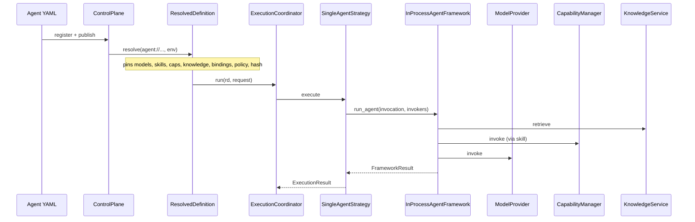

# §9 — Agent Architecture

## How an AgentSpec becomes executable

## Trace (files)

| Step | Location |
| --- | --- |
| Spec | `contracts/examples/auditor-report-agent.yaml` → `Agent` / `AgentSpec` |
| Resolve | `Resolver.resolve` |
| Run API | `EapApplication.run_agent` → `_run_target` |
| Coordinate | `ExecutionCoordinator.run` |
| Strategy | `SingleAgentStrategy.execute` |
| Framework | `InProcessAgentFramework.run_agent` (**not MAF**) |
| Model | `ModelProvider.invoke(rd, agent.spec.model, …)` |
| Skills/caps | `CapabilityManager.invoke` |
| Knowledge | `KnowledgeService.retrieve` |
| Response | `ResponseService.build` |

## Notes

- Direct `agent.spec.capabilities` are passed on `AgentInvocation` but **unused** by `InProcessAgentFramework` (skills drive tool calls).  
- HITL triggers only when `effective_policy.data_classification == "restricted"` and approval is not auto-approved.
