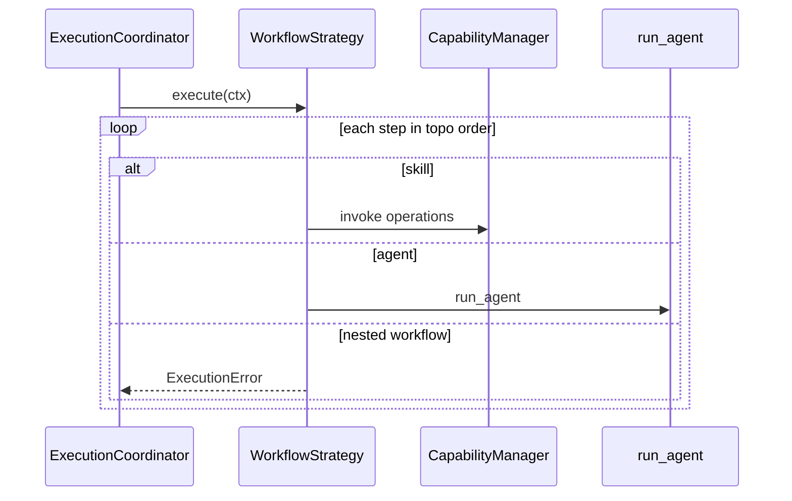

# §10 — Workflow Architecture

## Spec vs runtime

`WorkflowPattern` enum (**spec**, `workflow.py`):

| Pattern | In enum | Executed by WorkflowStrategy |
| --- | --- | --- |
| sequential | yes | Yes (implicit when no/`depends_on` forms a chain) |
| parallel | yes | **No** — steps still run one-by-one in topo order |
| graph | yes | **Yes** — `depends_on` topo-sort |
| fan_out_fan_in | yes | **No** dedicated fan-in semantics |
| iterative | yes | **No** (also separate `IterativeStrategy` STUBBED) |
| dynamic | yes | **No** |

**Honest summary:** Runtime supports **dependency-graph / sequential execution** of skill and agent steps. Do not claim parallel, iterative, or dynamic workflow execution.

## Implemented behavior — `WorkflowStrategy`

File: `runtime/strategies/workflow.py`

1. Topological order over `depends_on`  
2. Resolve `${input.x}` / `${step.output…}` placeholders  
3. `type: skill` → `_run_skill` (deterministic capabilities only)  
4. `type: agent` → shared `run_agent`  
5. `type: workflow` → raises (nested unsupported)  
6. Emit `output_targets`

## Sequence

## Example

`contracts/examples/rating-note-workflow.yaml` — exercised by `tests/test_workflow.py`.

## HTTP gap

`EapApplication.run_workflow` exists; **no** `/v1/workflows/run` FastAPI route in `app.py`.
