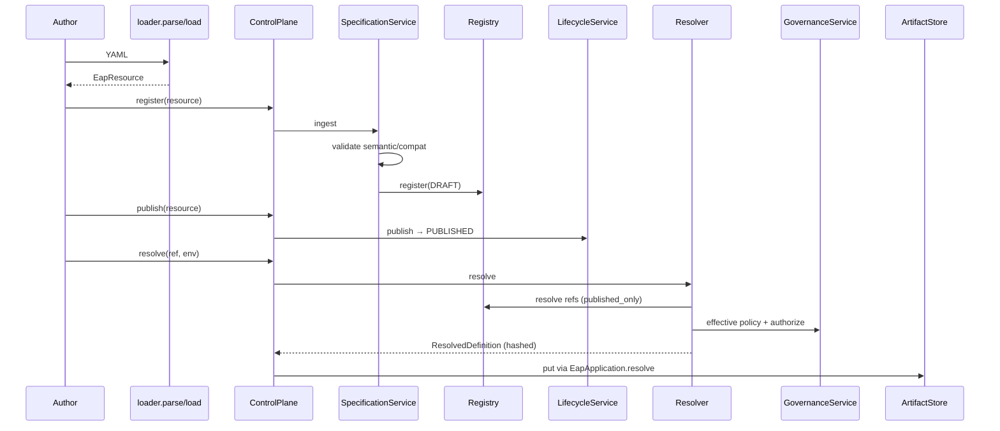

# §5 — Specification Lifecycle

## Actual flow (code-traced)

```
YAML file
  → load_file / load_yaml / parse_resource          (specifications/loader.py)
  → Pydantic validation (schema + ref schemes)
  → EapApplication.register / ControlPlane.register
  → SpecificationService.ingest
       · validate() semantic + compatibility
       · Registry.register (draft by default)
  → optional LifecycleService.publish
  → EapApplication.resolve / ControlPlane.resolve
  → Resolver.resolve
       · Registry.resolve (pin version / alias)
       · walk dependency graph into ResolvedBundle
       · inline CapabilityBindings for environment
       · GovernanceService.build_effective_policy + authorize
       · ResolvedDefinition.finalize() → content_hash
  → ArtifactStore.put(resolved/{hash}.json)
  → Runtime may execute only this RD
```

## Sequence diagram



## Key methods

| Step | Class | Method |
| --- | --- | --- |
| Parse | `loader` | `load_file`, `load_yaml`, `parse_resource` |
| Validate | `SpecificationService` | `validate`, `ingest` |
| Register | `Registry` | `register` |
| Publish | `LifecycleService` | `publish` / `deprecate` / `promote` |
| Resolve | `Resolver` | `resolve` |
| Govern | `GovernanceService` | `build_effective_policy`, `authorize` |
| Persist RD | `EapApplication` | `resolve` → `artifacts.put` |

## Notes

- Unpublished resources cannot resolve when `published_only=True` (default). Evidence: `tests/test_control_plane.py::test_unpublished_cannot_resolve`.
- Missing env bindings fail resolve. Evidence: `test_missing_binding_raises`.
- Dangling references are typically caught at **resolve** time (registry miss), not always at ingest.
